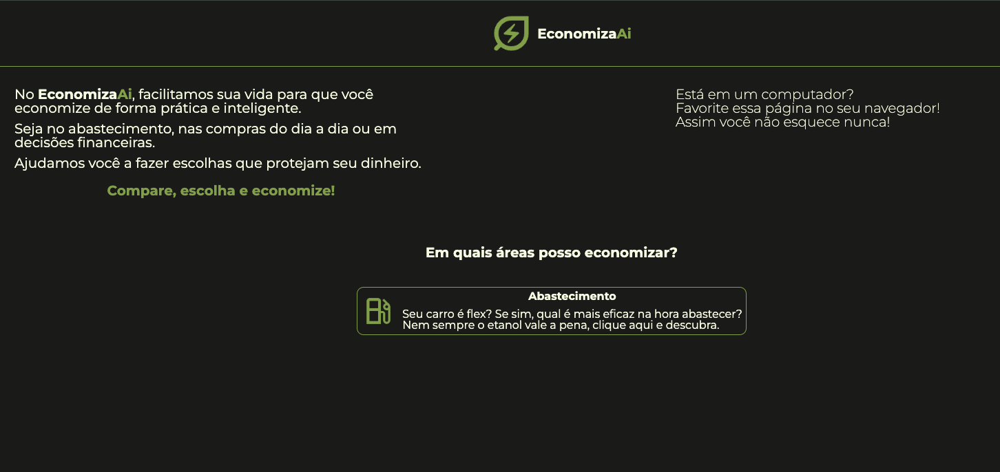

# 📌 EconomizaAi

EconomizaAi é um site criado para ajudar as pessoas a economizarem no dia a dia. Inicialmente, a plataforma auxilia motoristas a decidirem entre abastecer com **etanol ou gasolina**, garantindo a melhor escolha econômica. Futuramente, novas funcionalidades serão implementadas para oferecer mais formas de economizar dinheiro em diferentes situações cotidianas.

## 🔥 Funcionalidades
- Comparador de combustíveis (etanol vs. gasolina)
- Cálculo automático baseado no preço informado pelo usuário
- Interface intuitiva e responsiva

## 🚀 Tecnologias Utilizadas
- **HTML5** - Estrutura do site
- **CSS3** - Estilização e responsividade
- **JavaScript** - Lógica de cálculo e interatividade

## 📷 Demonstração
Adicione aqui uma screenshot ou um GIF do site em funcionamento para ilustrar seu funcionamento.



## 🎯 Como Rodar o Projeto
1. Clone este repositório:
   ```sh
   git clone https://github.com/seu-usuario/economizaai.git
   ```
2. Acesse a pasta do projeto:
   ```sh
   cd economizaai
   ```
3. Abra o arquivo `index.html` no navegador.

## 🔧 Melhorias Futuras
- Adicionar novos módulos de economia para outras situações do dia a dia
- Implementar uma versão mobile-first aprimorada
- Criar um banco de dados para histórico de cálculos
- Melhorar a estilização da página

## 📌 Contribuição
Se você quiser contribuir com melhorias para o projeto, fique à vontade para abrir uma _issue_ ou fazer um _pull request_. Toda ajuda é bem-vinda!


